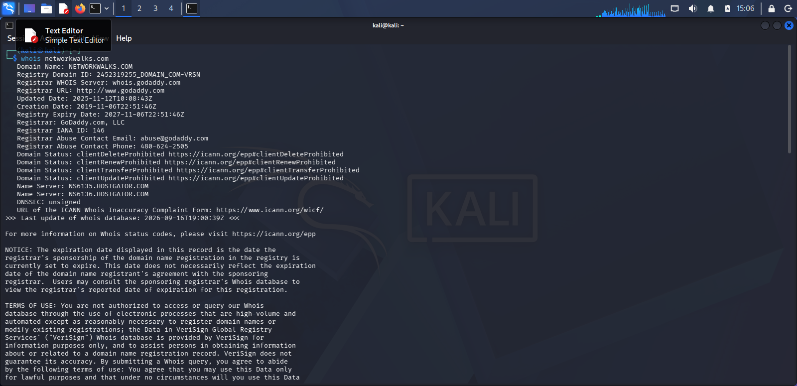
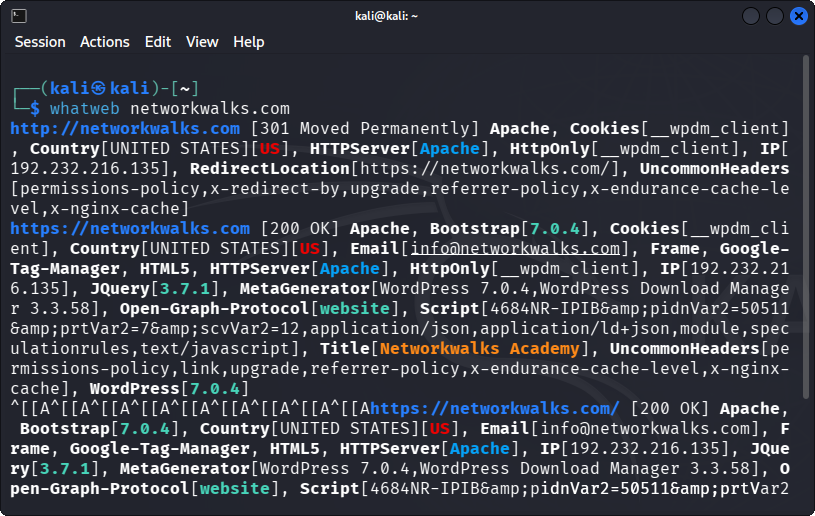
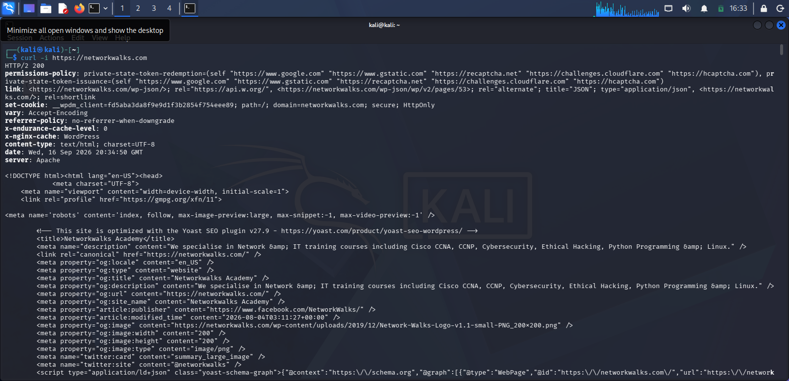
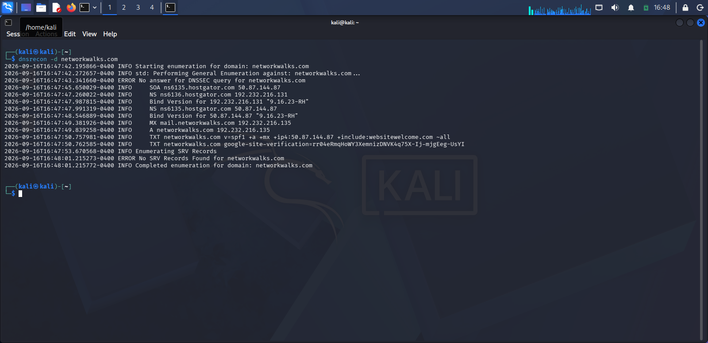

# 🕵️ PM1 - Footprinting with Multiple Kali Tools

## 📌 Overview

This lab uses six built-in Kali Linux tools to footprint the live website **networkwalks.com**, gathering public information about the domain, its technologies, IP address, HTTP headers, firewall presence, and DNS records — all without directly attacking the target.

## 🎯 Objectives

- Run `whois` to find domain registration details
- Run `whatweb` to fingerprint web technologies
- Run `nslookup` to resolve the domain to its IP address
- Run `curl -I` to read HTTP response headers
- Run `wafw00f` to detect a Web Application Firewall
- Run `dnsrecon` to enumerate DNS records

## 🪜 Steps & Findings

### 1️⃣ whois — Domain Registration

whois networkwalks.com

Revealed the registrar (GoDaddy), registration/expiry dates, and name servers pointing to HostGator — instantly showing the hosting provider.

### 2️⃣ whatweb — Technology Fingerprinting

whatweb networkwalks.com

Identified the site runs on **Apache** with **WordPress**, including specific plugin versions — information an attacker could use to search for known vulnerabilities.

### 3️⃣ nslookup — DNS Resolution

nslookup networkwalks.com

Resolved the domain to its real IP address.

### 4️⃣ curl -I — HTTP Headers

curl -I https://networkwalks.com

Showed server banner, caching headers, and a WordPress REST API endpoint (`/wp-json/`).

### 5️⃣ wafw00f — Firewall Detection

wafw00f networkwalks.com

Confirmed the site is protected by **ModSecurity (SpiderLabs) WAF**.

### 6️⃣ dnsrecon — DNS Enumeration

dnsrecon -d networkwalks.com

Enumerated name servers, mail servers, SPF/TXT records, and cPanel service records.

## 🐞 Problem Encountered & Solution

While running `whatweb networkwalks.com`, the command failed with an **"execution expired"** error (a timeout — whatweb couldn't get a response from the target in time). This was likely a transient network/connectivity hiccup rather than an issue with the tool or target itself.

**Fix:** Simply re-ran the same command, and it completed successfully on the second attempt.

## 💡 What I Learned

- Passive footprinting tools gather a surprising amount of information without ever "touching" the target in an intrusive way.
  
- Each tool reveals a different layer: `whois` and DNS tools expose ownership/hosting, `whatweb`/`curl` expose the tech stack, and `wafw00f` reveals defensive measures.
  
- Real-world tools can be flaky — transient timeouts don't always mean something is broken; retrying is a normal part of the workflow.

## ⚠️ Ethical Note

This footprinting was performed only against `networkwalks.com`, the training organization's own domain provided for educational lab purposes.
