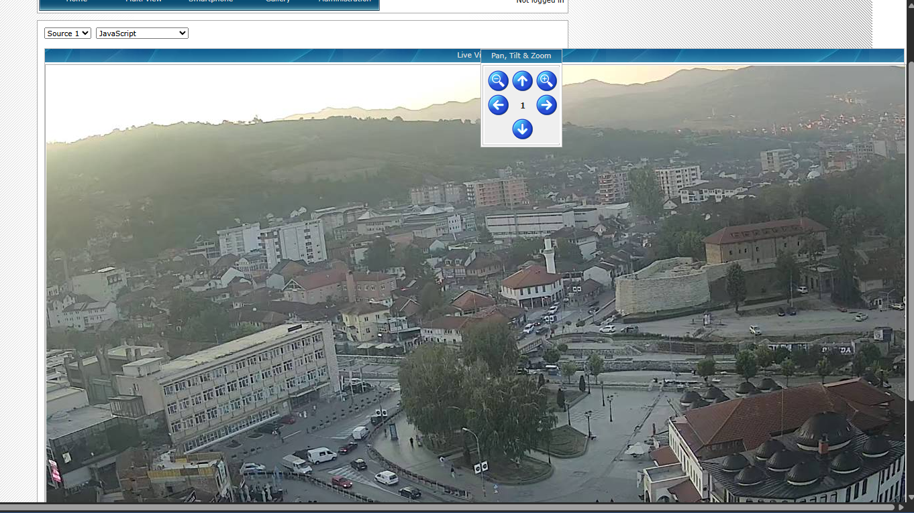
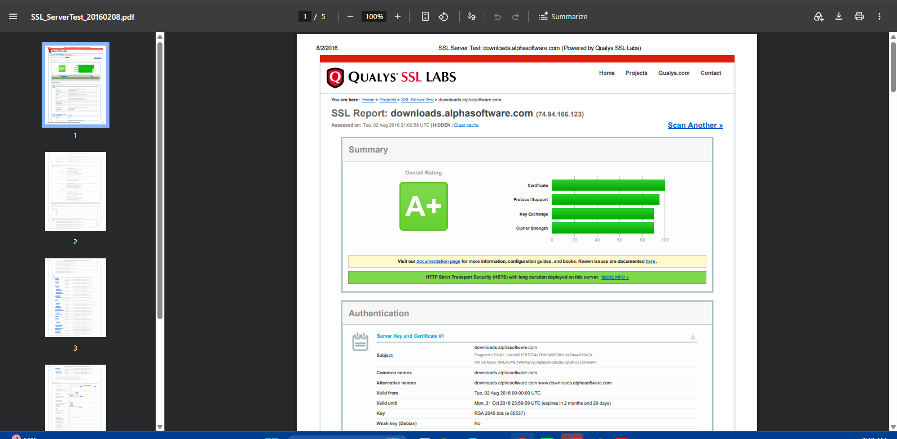

# 🔍 PM2 - Footprinting & Reconnaissance with GHDB

## 📌 Overview

This lab uses the **Google Hacking Database (GHDB)** to footprint real world targets through Google search alone no direct interaction with any target. GHDB dorks are specially crafted Google search queries that surface sensitive information websites have accidentally exposed publicly.

## 🎯 Objectives

- Find 10 live, exposed security camera feeds using GHDB dorks
- Find 10 listings containing downloadable mathematics PDFs using GHDB dorks

## 🪜 Steps Performed

1. Opened [exploit-db.com](https://www.exploit-db.com) and navigated to the **GHDB** section
2. Searched relevant terms (e.g. "cam") to find applicable dorks
3. Copied each dork and ran it directly in Google Search
4. Opened each result to verify it was actually live/accessible
5. Recorded the link, the exact dork used, and any exposed credentials for each valid finding

📄 **Full findings table (20 entries):** [PM2-GHDB-Findings.docx](./PM2-GHDB-Findings.docx)

## 📸 Example Findings

## 💡 What I Learned

- Google itself can act as a powerful reconnaissance tool without needing any specialized software just the right search syntax.
  
- Many organizations unknowingly expose devices and files to the public internet simply because they were never properly secured or indexed away from search engines.
  
- This is why defenders run the same GHDB dorks against their own domains regularly to catch leaks before an attacker does.

## ⚠️ Ethical Note

All findings here were only **viewed** to confirm the dork worked no login attempts, downloads, or further interaction was performed beyond passive verification. This lab used only publicly indexed information.
