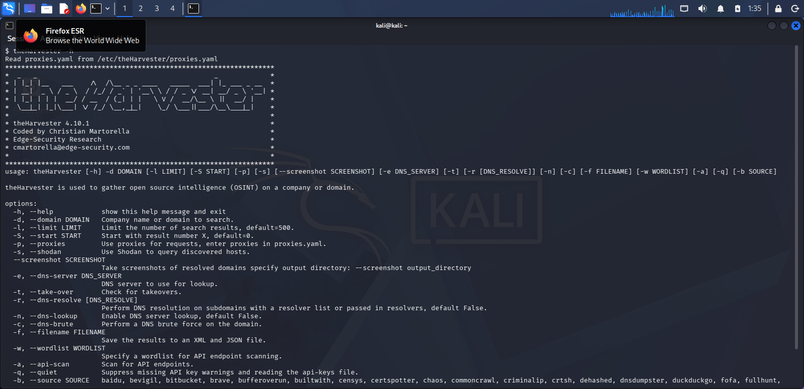
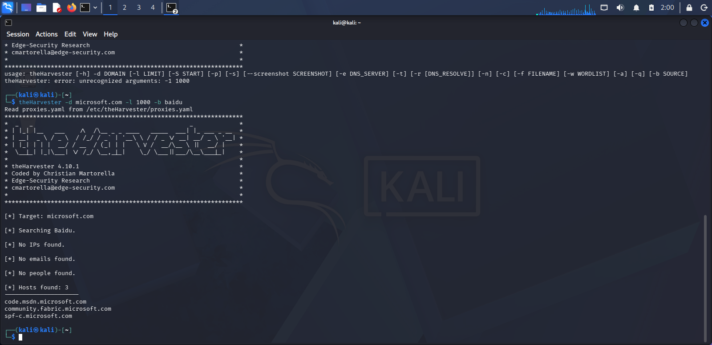
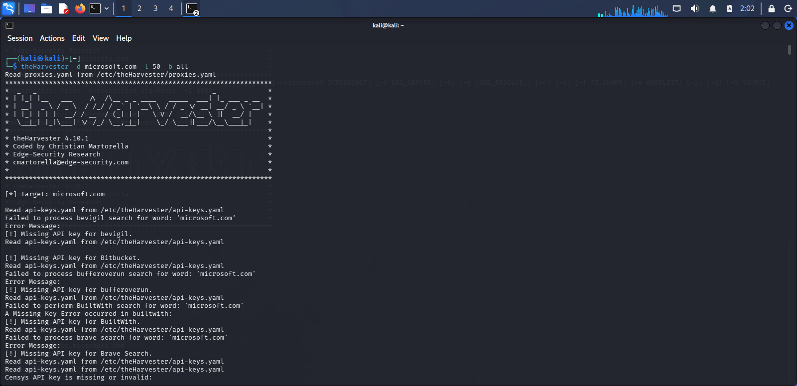
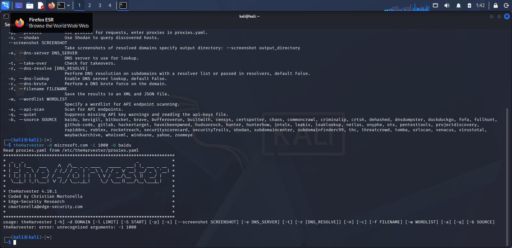

# 🌾 PM4 - Footprinting with theHarvester

## 📌 Overview

**theHarvester** is a passive OSINT tool that gathers emails, sub-domains, hosts, and other public information about a target organization from dozens of public sources  without ever directly contacting the target.

## 🎯 Objectives

- Find email IDs & sub-domains for **microsoft.com** using Baidu as the source, limited to 1000 results
  
- Find email IDs & sub-domains for **microsoft.com** using all sources, limited to 50 results

## 🪜 Steps & Findings

### Task 1 Baidu Source

theHarvester -d microsoft.com -l 1000 -b baidu

Found email address(es) and host information using Baidu as the single data source.

### Task 2 All Sources

theHarvester -d microsoft.com -l 50 -b all

Running against **all** available sources returned significantly more results than the single-source Baidu search, despite the lower result limit (50 vs 1000) showing how much broader coverage comes from combining multiple OSINT sources rather than relying on just one.

## 🐞 Problem Encountered & Solution

Initially got an error: `unrecognized arguments: -1 1000`. The issue was a typo I had typed `-1` (the number one) instead of `-l` (lowercase L, the limit flag). These two characters look nearly identical in many fonts.

**Fix:** Corrected the flag to lowercase `-l` and the command ran successfully.

## 💡 What I Learned

- Different OSINT sources return very different results relying on just one source can miss a lot of exposed information.
- Small command-line typos (like `-1` vs `-l`) can cause confusing errors; reading error messages carefully helps spot these quickly.
- theHarvester is a great example of "passive" recon it never touches the target directly, just queries public data sources.

## ⚠️ Ethical Note

This lab targeted `microsoft.com` only as an educational exercise using publicly available OSINT sources no direct interaction with Microsoft's systems occurred.
