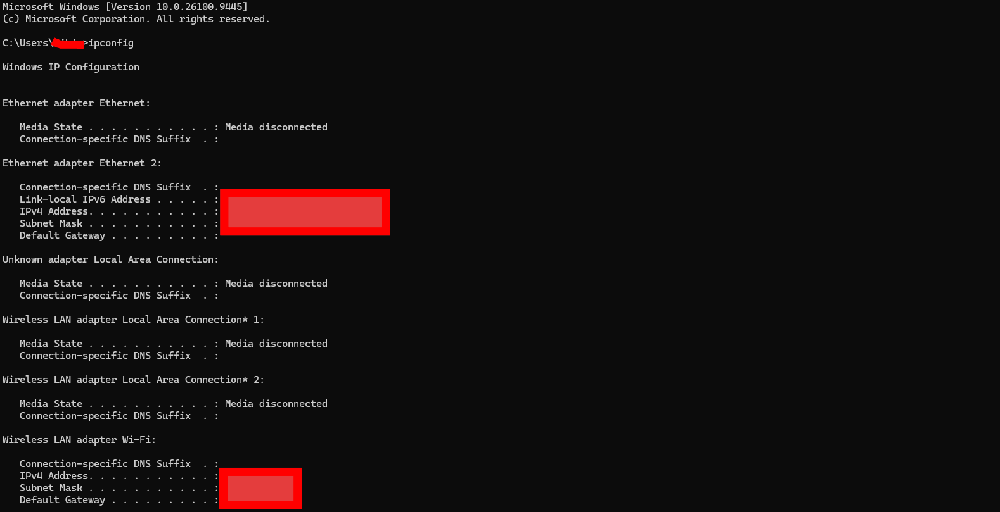
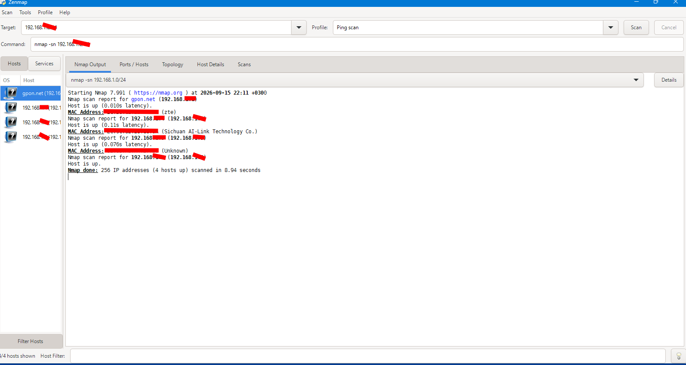
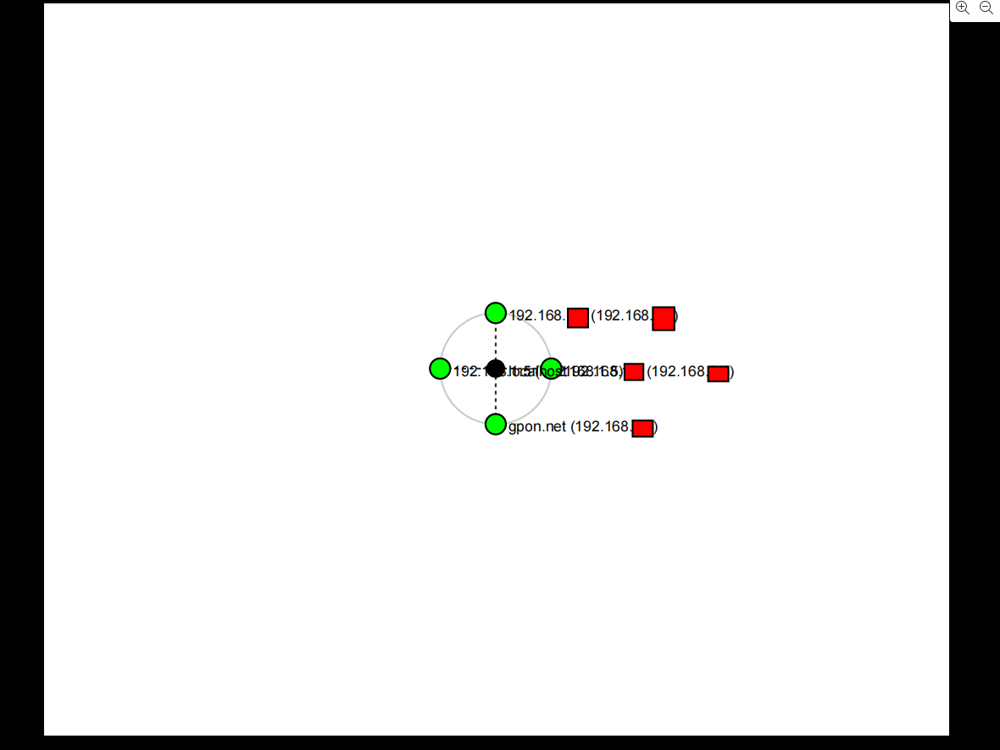

# 🛰️ PM5 - Network Scanning with Zenmap

## 📌 Overview

This lab covers installing **Zenmap** (the official GUI for Nmap) and using it to discover live devices on a local network, identify their IP and MAC addresses, and visualize how the network is connected all without needing to write raw Nmap commands manually.

## 🎯 Objectives

- Install Zenmap on a Windows PC
- Identify the local IP address and subnet using `ipconfig`
- Run a Ping Scan across the subnet to discover live hosts
- Record the number of live hosts, their IPs, and MAC addresses
- Visualize and save the network topology

## 🪜 Steps Performed

**1. Installed Zenmap**

Downloaded Zenmap from the official Nmap website and installed it on Windows.

**2. Found local IP & subnet**

Ran `ipconfig` in Command Prompt to identify the active network adapter's IPv4 address and subnet mask.

**3. Ran a Ping Scan**

Opened Zenmap, entered the local subnet (`/24`) as the target, selected the **Ping scan** profile, and ran the scan.

nmap -sn <local-subnet>/24

**4. Reviewed results**

The scan completed in under 10 seconds and identified **4 live hosts** on the network (including the router/gateway).

**5. Visualized the topology**

Opened the **Topology** tab in Zenmap, enabled the legend, and saved the network map as a graphic.

## 📊 Findings

| Item | Result |
|---|---|
| 🖥️ Local subnet scanned | `/24` (redacted) |
| ✅ Live hosts found | 4 |
| ⏱️ Scan duration | ~9 seconds |
| 🌐 Gateway identified | Yes (router, labeled by ISP hostname) |

🔒 **Note:** Exact IP and MAC addresses have been redacted from screenshots for privacy. 

## 💡 What I Learned

- A **Ping Scan** (`-sn`) is a fast, lightweight way to discover which devices are active on a network without probing their open ports.
- Zenmap turns raw Nmap output into a visual map, making it much easier to understand network layout at a glance.
- Even a home network setup reveals useful info: router presence, number of connected devices, and vendor hints from MAC address prefixes.
- I learned that this kind of scan is exactly what an attacker would run first to map out a target network.

## ⚠️ Ethical Note

This scan was performed only on my own private home network, which I own and have full authority to test.
